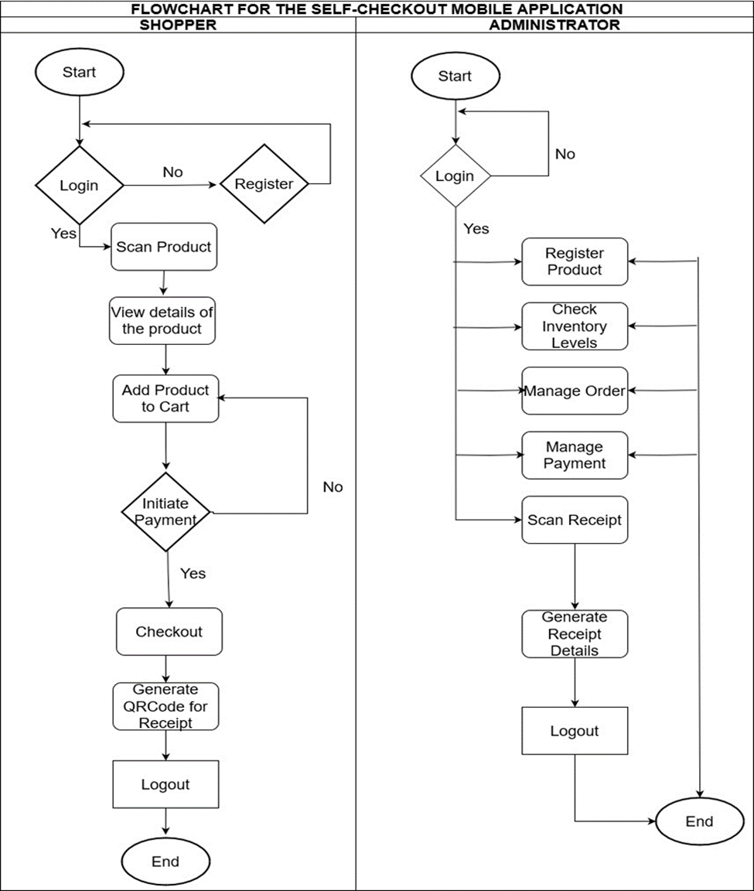
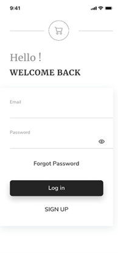
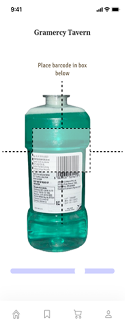
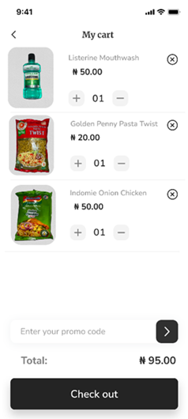
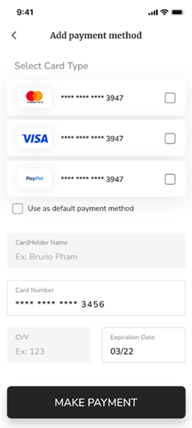
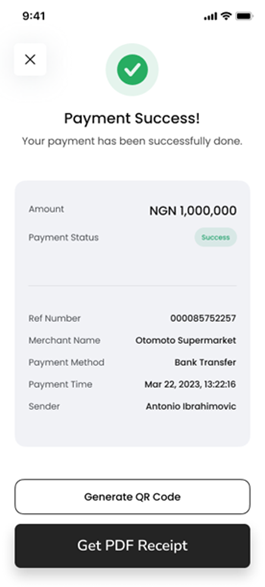
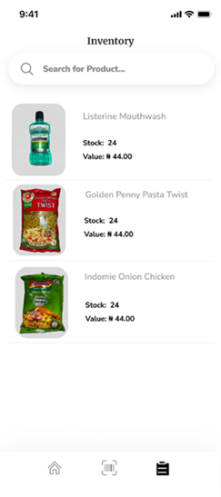
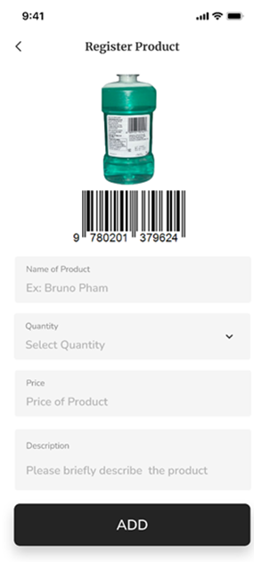

# Swift-Scan Mobile App

Swift-Scan is a modern self-checkout mobile application designed to revolutionize the supermarket shopping experience. Developed using React Native and Firebase, this innovative app allows users to scan, manage, and pay for their purchases directly from their smartphones, eliminating the need for traditional cashier-based checkout systems.

## Features

- **Efficient Checkout**: Say goodbye to long queues and waiting times at the checkout counter.
- **Product Scanning**: Easily scan items using your smartphone camera for quick and accurate checkout.
- **Cart Management**: Add, remove, and adjust quantities of items in your virtual shopping cart with ease.
- **Secure Payments**: Pay securely using integrated payment gateways, including credit/debit cards and mobile wallets. 
- **Real-time Receipts**: Receive instant digital receipts for all transactions, accessible directly from the app.

## Installation

1. Clone the repository: `git clone https://github.com/JoshuaOloton/swift-scan.git`
2. Install dependencies: `npm install`
3. Set up Firebase: Follow the instructions in the [Firebase documentation](https://firebase.google.com/docs/web/setup) to set up Firebase for your project.
4. Configure Firebase credentials: Replace the Firebase configuration in `src/firebase/config.js` with your own Firebase project credentials.
5. Run the app: `npm run dev` or `react-native run-android` / `react-native run-ios`

## Project FlowChart

## Customer Workflow
The workflow from the customer’s access point is shown below: 
- #### Login
    - The user provides their valid username/email and password to gain access to the customer interface.

- #### Product Scanning
    - Customers utilize the barcode scanner on the app to scan products.
    - Product details and prices are displayed upon successful scanning.
    - Selected products are added to the customer's online cart.

- #### Shopping Process
    - Customers continue shopping, scanning, and adding products to their carts.
    - A user-friendly interface ensures a seamless shopping experience.

 

    
    
Login Screen

 

    
    
Customer Scan Page

- #### Checkout and Payment
    - Customers proceed to checkout.
    - The app facilitates payment through a trusted payment provider using the customer's credit card details.
    - An online receipt is generated upon successful payment.
- #### In-Store Checkout
    - Customers present the online receipt at a dedicated checkout counter.
    - The attendant verifies the items, expediting the process as scanning and payment have already been completed.
- #### Finalization
    - Items are packed, and the customer can promptly depart from the supermarket or shopping mall.

     
    

        
        
Customer adds Product to Cart

    

     
    

        
        
Checkout Page

    

     
    

        
        
Payment Confirmation

    

## Supermarket Admin Interface
### 1. RESPONSIBILITIES
- #### Inventory Management:
    - The admin is responsible for adding new products to the supermarket inventory.
    - This involves scanning the barcode of each product and entering the corresponding name and price information.
    - The admin interface facilitates a streamlined process for adding multiple products efficiently.

     
    

        
        
Admin Inventory Page

    

- #### Data Entry:
    - The admin interface provides a user-friendly form to input necessary details for each scanned product, ensuring accurate and comprehensive data entry.
    - Validation mechanisms are implemented to maintain data integrity.

- #### Product Overivew:
    - Admins can view a comprehensive list of all added products within the supermarket inventory.
    - This overview includes product names, prices, and other relevant details for easy reference.

- #### Deletion Privileges
    - The admin has the privilege to delete any product from the inventory when necessary.
    - This capability ensures the ability to manage and update the inventory effectively.

     
    

        
        
Admin Data Entry

    

### 2. WORKFLOW
1.	**Login**: The admin logs into the Supermarket Checkout App with privileged access.
2.	**Barcode Scanning**: The admin scans the barcode of a new product using the admin interface.
3.	**Data Entry**: The interface prompts the admin to enter the name and price of the scanned product.
4.	**Add to Inventory**: The admin adds the product to the supermarket inventory upon entering the required details.
5.	**Repeat Process**: The admin repeats the scanning and data entry process for any additional products that need to be added to the inventory.
6.	**Product Overview**: The admin can view a comprehensive list of all added products in the inventory, providing an organised overview.
7.	**Deletion Process**: If necessary, the admin can select a product from the list and delete it from the inventory.
8.	**Confirmation**: The admin interface provides confirmation prompts to ensure accurate deletion and prevent accidental removal of products.
9.	**Logout**: After completing the necessary inventory management tasks, the admin logs out to secure the privileged access.

## Contributing

Contributions are welcome! Feel free to open issues or pull requests for any improvements, bug fixes, or feature requests.

## License

This project is licensed under the [MIT License](LICENSE).

